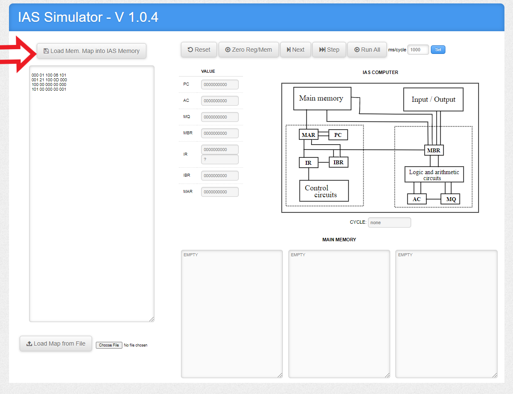

 

# IAS - ASSEMBLER 💥

### 🤯 About

    Just a test of how the assembly works.

## Curiosity

    The IAS computer was one of the first computers to implement a “stored program concept”. In this paradigm, the program is stored in the computer's memory along with the data. In this way, the generation and loading of programs can be done in an automated way, by the computer itself. The IAS computer was developed at the Institute for Advanced Studies at Princeton and its construction was led by John von Neumann, a mathematician who contributed greatly to the field of computer science.

## Study materials

- [Programming the IAS](https://www.ic.unicamp.br/~edson/disciplinas/mc404/2017-2s/abef/anexos/programando_o_IAS.pdf)

- [10_Instruction_Sets_characteristics2](https://faculty.tarleton.edu/agapie/documents/cs_343_arch/10_Instruction_Sets_characteristics2.pdf)

- [Linux System Call Table for x86](https://blog.rchapman.org/posts/Linux_System_Call_Table_for_x86_64/)

## Solved Exercises

- Implement an Incrementor and a Decrementor

  
  

- Implement the expression below:

  `x = ((A − B) × C) / (D − (E × F))`

## How to Run

- Access the simulator: [IAS–Assembler](http://www.ic.unicamp.br/~edson/disciplinas/mc404/2017-2s/abef/IAS-Assembler/assembler.html);

- Copy and paste the file you want to test

- Just click on **Load IAS Sim**

  

- Maximize the IAS Simulator window

- Click in **Load Mem. Map into IAS Memory**

  

- Now click on **Step** and visualize the memories being filled

  

## Links and Videos

- [Assembly Language & Computer Architecture](https://www.youtube.com/watch?v=L1ung0wil9Y)

- [What Is Assembly Language?](https://www.youtube.com/watch?v=1FXhjErUz58)

- [Demonstration of IAS Machine](https://www.youtube.com/watch?v=mVbxrQE4f90)

- [Assembly Language Program using IAS Instruction Set](https://www.youtube.com/watch?v=g87sv5rcmE4)

- [Address Instruction Format Example](https://www.youtube.com/watch?v=c5SeaGE5Vuw)
